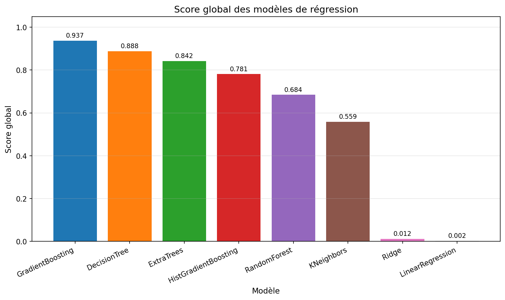
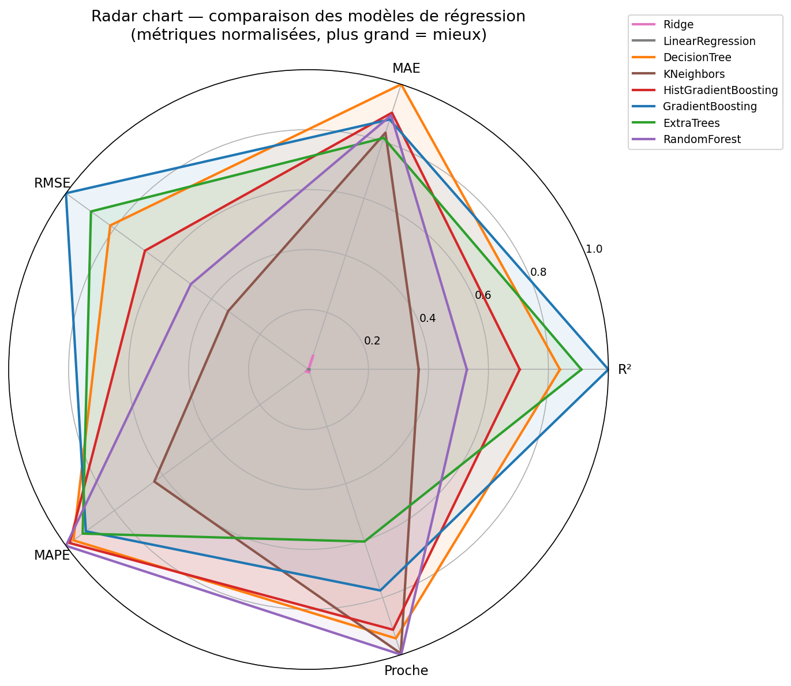

# Rapport — Comparaison des modèles de régression IDFM

**Date :** 2026-04-03  
**Heure :** 19:55:25  
**Source CSV :** `dataset_predictions/dataset_ml.csv`  
**Lignes utilisées :** 68,584  
**Évaluation :** KFold k=5 (shuffle, random_state=42)  
**Hyperparamètres :** GridSearchCV (cv=3, scoring=r²)  

---

## Features utilisées

  - **Identification ligne** : `nom_ligne`, `direction_ref`
  - **Temporelles** : `heure_tranche`, `mois`, `jour_semaine`, `periode_journee`, `jour_ferie`
  - **Destination & arrêt** : `terminus_encoded`, `station_encoded`
  - **Météo horaire** : `meteo_groupe`, `precipitation`, `snowfall`, `wind_speed`, `temperature`
  - **Alertes réseau PRIM** : `categorie_alerte`
  - **Fréquentation arrêt** : `occupation`

### Détail des features

| Feature | Type | Description |
|---------|------|-------------|
| `nom_ligne` | Catégorielle | Nom de la ligne (Métro 1, RER A…) — encodé entier fixe |
| `jour_semaine` | Catégorielle | Lundi … Dimanche — encodé entier fixe |
| `periode_journee` | Catégorielle | Pointe matin / Creuse / Méridienne / Pointe soir… — encodé entier fixe |
| `meteo_groupe` | Catégorielle | Groupe météo horaire (ensoleille / pluie / neige / orage…) — encodé entier fixe |
| `categorie_alerte` | Catégorielle | Type d'alerte PRIM (aucune / greve / incident / travaux…) — encodé entier fixe |
| `heure_tranche` | Numérique | Heure de passage (0–23) |
| `mois` | Numérique | Mois de l'année (1–12) |
| `jour_ferie` | Numérique | 1 si jour férié français, 0 sinon |
| `occupation` | Numérique | Nombre moyen d'entrées/heure à l'arrêt (données IDFM) |
| `direction_ref` | Numérique | Sens de la course : 1=aller, 2=retour, 0=inconnu |
| `terminus_encoded` | Numérique | Retard moyen historique du terminus (target encoding) |
| `station_encoded` | Numérique | Retard moyen historique de l'arrêt (target encoding) |
| `precipitation` | Numérique | Précipitations en mm/h |
| `snowfall` | Numérique | Chutes de neige en cm |
| `wind_speed` | Numérique | Vitesse du vent en km/h |
| `temperature` | Numérique | Température en °C |

---

## Visualisation du score global

> Plus le score global est élevé, meilleur est le compromis global entre R², RMSE, MAE, MAPE et pourcentage de prédictions proches.

## Visualisation radar des modèles

> Chaque axe correspond à une métrique normalisée entre 0 et 1. Pour toutes les dimensions, plus la valeur est élevée, meilleur est le modèle.

---

## Classements par métrique

> Métriques calculées par KFold k=5. Format : **moyenne ± écart-type**.

> Le **score global** est un score pondéré défini comme suit : `0.35×R² + 0.25×RMSE_norm_inverse + 0.20×MAE_norm_inverse + 0.15×Proche≤60s_norm + 0.05×MAPE_norm_inverse`.

### Score global pondéré (↑ mieux)

| Rang | Modèle | Dataset | Valeur (moy ± std) | Meilleurs params |
|:----:|--------|---------|-------------------:|------------------|
| 1 | GradientBoosting | ML-ready | 0.937 | `{'learning_rate': 0.2, 'max_depth': 3, 'n_estimators': 100}` |
| 2 | DecisionTree | ML-ready | 0.888 | `{'max_depth': 12, 'min_samples_leaf': 5, 'min_samples_split': 2}` |
| 3 | ExtraTrees | ML-ready | 0.842 | `{'max_depth': 10, 'min_samples_leaf': 5, 'n_estimators': 200}` |
| 4 | HistGradientBoosting | ML-ready | 0.781 | `{'l2_regularization': 0.0, 'learning_rate': 0.2, 'max_iter': 200, 'max_leaf_nodes': 31}` |
| 5 | RandomForest | ML-ready | 0.684 | `{'max_depth': 20, 'min_samples_leaf': 20, 'n_estimators': 100}` |
| 6 | KNeighbors | ML-ready | 0.559 | `{'n_neighbors': 10, 'weights': 'distance'}` |
| 7 | Ridge | ML-ready | 0.012 | `{'alpha': 100.0}` |
| 8 | LinearRegression | ML-ready | 0.002 | `—` |

### R² — variance expliquée (↑ mieux)

| Rang | Modèle | Dataset | Valeur (moy ± std) | Meilleurs params |
|:----:|--------|---------|-------------------:|------------------|
| 1 | GradientBoosting | ML-ready | 0.788 ± 0.016 | `{'learning_rate': 0.2, 'max_depth': 3, 'n_estimators': 100}` |
| 2 | ExtraTrees | ML-ready | 0.768 ± 0.024 | `{'max_depth': 10, 'min_samples_leaf': 5, 'n_estimators': 200}` |
| 3 | DecisionTree | ML-ready | 0.752 ± 0.042 | `{'max_depth': 12, 'min_samples_leaf': 5, 'min_samples_split': 2}` |
| 4 | HistGradientBoosting | ML-ready | 0.722 ± 0.044 | `{'l2_regularization': 0.0, 'learning_rate': 0.2, 'max_iter': 200, 'max_leaf_nodes': 31}` |
| 5 | RandomForest | ML-ready | 0.683 ± 0.039 | `{'max_depth': 20, 'min_samples_leaf': 20, 'n_estimators': 100}` |
| 6 | KNeighbors | ML-ready | 0.648 ± 0.039 | `{'n_neighbors': 10, 'weights': 'distance'}` |
| 7 | LinearRegression | ML-ready | 0.567 ± 0.023 | `—` |
| 8 | Ridge | ML-ready | 0.567 ± 0.022 | `{'alpha': 100.0}` |

### MAE (s) — erreur moyenne absolue (↓ mieux)

| Rang | Modèle | Dataset | Valeur (moy ± std) | Meilleurs params |
|:----:|--------|---------|-------------------:|------------------|
| 1 | DecisionTree | ML-ready | 68.4 ± 0.9 | `{'max_depth': 12, 'min_samples_leaf': 5, 'min_samples_split': 2}` |
| 2 | HistGradientBoosting | ML-ready | 72.8 ± 1.9 | `{'l2_regularization': 0.0, 'learning_rate': 0.2, 'max_iter': 200, 'max_leaf_nodes': 31}` |
| 3 | RandomForest | ML-ready | 73.1 ± 0.9 | `{'max_depth': 20, 'min_samples_leaf': 20, 'n_estimators': 100}` |
| 4 | GradientBoosting | ML-ready | 73.8 ± 0.5 | `{'learning_rate': 0.2, 'max_depth': 3, 'n_estimators': 100}` |
| 5 | KNeighbors | ML-ready | 75.8 ± 1.6 | `{'n_neighbors': 10, 'weights': 'distance'}` |
| 6 | ExtraTrees | ML-ready | 76.6 ± 0.8 | `{'max_depth': 10, 'min_samples_leaf': 5, 'n_estimators': 200}` |
| 7 | Ridge | ML-ready | 109.6 ± 1.0 | `{'alpha': 100.0}` |
| 8 | LinearRegression | ML-ready | 111.7 ± 1.3 | `—` |

### RMSE (s) — pénalise les grandes erreurs (↓ mieux)

| Rang | Modèle | Dataset | Valeur (moy ± std) | Meilleurs params |
|:----:|--------|---------|-------------------:|------------------|
| 1 | GradientBoosting | ML-ready | 202.5 ± 4.5 | `{'learning_rate': 0.2, 'max_depth': 3, 'n_estimators': 100}` |
| 2 | ExtraTrees | ML-ready | 211.5 ± 5.2 | `{'max_depth': 10, 'min_samples_leaf': 5, 'n_estimators': 200}` |
| 3 | DecisionTree | ML-ready | 218.4 ± 20.6 | `{'max_depth': 12, 'min_samples_leaf': 5, 'min_samples_split': 2}` |
| 4 | HistGradientBoosting | ML-ready | 230.9 ± 14.5 | `{'l2_regularization': 0.0, 'learning_rate': 0.2, 'max_iter': 200, 'max_leaf_nodes': 31}` |
| 5 | RandomForest | ML-ready | 247.4 ± 20.1 | `{'max_depth': 20, 'min_samples_leaf': 20, 'n_estimators': 100}` |
| 6 | KNeighbors | ML-ready | 260.8 ± 16.6 | `{'n_neighbors': 10, 'weights': 'distance'}` |
| 7 | LinearRegression | ML-ready | 289.5 ± 12.5 | `—` |
| 8 | Ridge | ML-ready | 289.7 ± 12.6 | `{'alpha': 100.0}` |

### MAPE (%) — erreur relative (↓ mieux)

| Rang | Modèle | Dataset | Valeur (moy ± std) | Meilleurs params |
|:----:|--------|---------|-------------------:|------------------|
| 1 | RandomForest | ML-ready | 181.644 ± 7.681 | `{'max_depth': 20, 'min_samples_leaf': 20, 'n_estimators': 100}` |
| 2 | HistGradientBoosting | ML-ready | 182.912 ± 5.807 | `{'l2_regularization': 0.0, 'learning_rate': 0.2, 'max_iter': 200, 'max_leaf_nodes': 31}` |
| 3 | DecisionTree | ML-ready | 184.175 ± 9.506 | `{'max_depth': 12, 'min_samples_leaf': 5, 'min_samples_split': 2}` |
| 4 | ExtraTrees | ML-ready | 187.306 ± 6.014 | `{'max_depth': 10, 'min_samples_leaf': 5, 'n_estimators': 200}` |
| 5 | GradientBoosting | ML-ready | 188.383 ± 7.473 | `{'learning_rate': 0.2, 'max_depth': 3, 'n_estimators': 100}` |
| 6 | KNeighbors | ML-ready | 211.555 ± 8.318 | `{'n_neighbors': 10, 'weights': 'distance'}` |
| 7 | Ridge | ML-ready | 262.814 ± 6.820 | `{'alpha': 100.0}` |
| 8 | LinearRegression | ML-ready | 263.763 ± 6.572 | `—` |

### Proche≤60s — % prédictions proches (↑ mieux)

| Rang | Modèle | Dataset | Valeur (moy ± std) | Meilleurs params |
|:----:|--------|---------|-------------------:|------------------|
| 1 | RandomForest | ML-ready | 74.313 ± 0.259 | `{'max_depth': 20, 'min_samples_leaf': 20, 'n_estimators': 100}` |
| 2 | KNeighbors | ML-ready | 74.255 ± 0.465 | `{'n_neighbors': 10, 'weights': 'distance'}` |
| 3 | DecisionTree | ML-ready | 73.524 ± 0.526 | `{'max_depth': 12, 'min_samples_leaf': 5, 'min_samples_split': 2}` |
| 4 | HistGradientBoosting | ML-ready | 73.106 ± 0.769 | `{'l2_regularization': 0.0, 'learning_rate': 0.2, 'max_iter': 200, 'max_leaf_nodes': 31}` |
| 5 | GradientBoosting | ML-ready | 71.209 ± 0.412 | `{'learning_rate': 0.2, 'max_depth': 3, 'n_estimators': 100}` |
| 6 | ExtraTrees | ML-ready | 68.844 ± 0.587 | `{'max_depth': 10, 'min_samples_leaf': 5, 'n_estimators': 200}` |
| 7 | Ridge | ML-ready | 60.667 ± 0.902 | `{'alpha': 100.0}` |
| 8 | LinearRegression | ML-ready | 60.529 ± 0.962 | `—` |

---

## Meilleur modèle global (Score global)

**[ML-ready] GradientBoosting**

| Métrique | Moyenne | Écart-type |
|----------|--------:|----------:|
| Score global | `0.9375` | — |
| R²       | `0.7876` | `0.0158` |
| MAE (s)  | `73.8` | `0.5` |
| RMSE (s) | `202.5` | `4.5` |
| MAPE (%) | `188.4` | `7.5` |
| Proche≤60s (%) | `71.2%` | `0.4%` |
| Params   | `{'learning_rate': 0.2, 'max_depth': 3, 'n_estimators': 100}` | — |

---

## Glossaire

| Métrique | Description |
|----------|-------------|
| **Score global** | Score pondéré entre 0 et 1 combinant R², RMSE, MAE, MAPE et % de prédictions proches. Plus il est élevé, meilleur est le compromis global. |
| **R²** | Part de variance expliquée. 1 = parfait, 0 = équivalent à prédire la moyenne. |
| **MAE** | Erreur absolue moyenne en secondes. |
| **RMSE** | Comme MAE mais les grandes erreurs sont amplifiées. |
| **MAPE** | Erreur en % relatif à la valeur réelle. Instable si retard ≈ 0. |
| **Proche≤60s** | % de prédictions à moins de 60s de la réalité. |
| **KFold k=5** | Validation croisée sur 5 blocs. L'écart-type mesure la stabilité. |