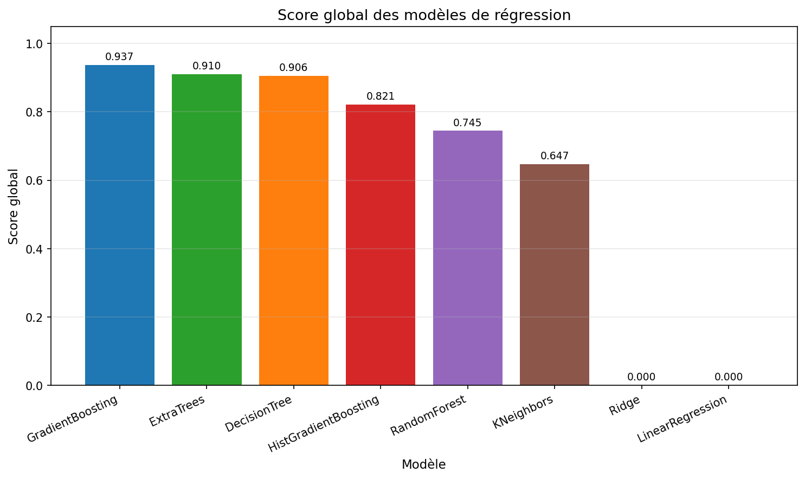
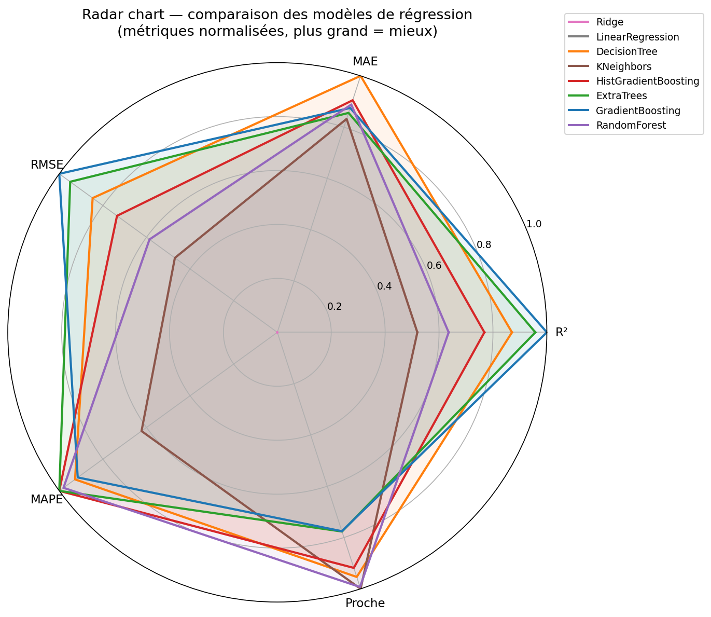

# Rapport — Comparaison des modèles de régression IDFM

**Date :** 2026-04-03  
**Heure :** 23:59:33  
**Source CSV :** `dataset_predictions/dataset_ml.csv`  
**Lignes utilisées :** 68,584  
**Évaluation :** KFold k=5 (shuffle, random_state=42)  
**Hyperparamètres :** GridSearchCV (cv=3, scoring=r²)  

---

## Features utilisées

  - **Identification ligne** : `nom_ligne`, `direction_ref`
  - **Temporelles** : `heure_tranche`, `mois`, `jour_semaine`, `periode_journee`, `jour_ferie`
  - **Destination & arrêt** : `terminus_encoded`, `station_encoded`
  - **Météo horaire** : `meteo_groupe`, `precipitation`, `snowfall`, `wind_speed`, `temperature`
  - **Alertes réseau PRIM** : `categorie_alerte`
  - **Fréquentation arrêt** : `occupation`

### Détail des features

| Feature | Type | Description |
|---------|------|-------------|
| `nom_ligne` | Catégorielle | Nom de la ligne (Métro 1, RER A…) — encodé entier fixe |
| `jour_semaine` | Catégorielle | Lundi … Dimanche — encodé entier fixe |
| `periode_journee` | Catégorielle | Pointe matin / Creuse / Méridienne / Pointe soir… — encodé entier fixe |
| `meteo_groupe` | Catégorielle | Groupe météo horaire (ensoleille / pluie / neige / orage…) — encodé entier fixe |
| `categorie_alerte` | Catégorielle | Type d'alerte PRIM (aucune / greve / incident / travaux…) — encodé entier fixe |
| `heure_tranche` | Numérique | Heure de passage (0–23) |
| `mois` | Numérique | Mois de l'année (1–12) |
| `jour_ferie` | Numérique | 1 si jour férié français, 0 sinon |
| `occupation` | Numérique | Nombre moyen d'entrées/heure à l'arrêt (données IDFM) |
| `direction_ref` | Numérique | Sens de la course : 1=aller, 2=retour, 0=inconnu |
| `terminus_encoded` | Numérique | Retard moyen historique du terminus (target encoding) |
| `station_encoded` | Numérique | Retard moyen historique de l'arrêt (target encoding) |
| `precipitation` | Numérique | Précipitations en mm/h |
| `snowfall` | Numérique | Chutes de neige en cm |
| `wind_speed` | Numérique | Vitesse du vent en km/h |
| `temperature` | Numérique | Température en °C |

---

## Visualisation du score global

> Plus le score global est élevé, meilleur est le compromis global entre R², RMSE, MAE, MAPE et pourcentage de prédictions proches.

## Visualisation radar des modèles

> Chaque axe correspond à une métrique normalisée entre 0 et 1. Pour toutes les dimensions, plus la valeur est élevée, meilleur est le modèle.

---

## Classements par métrique

> Métriques calculées par KFold k=5. Format : **moyenne ± écart-type**.

> Le **score global** est un score pondéré défini comme suit : `0.35×R² + 0.25×RMSE_norm_inverse + 0.20×MAE_norm_inverse + 0.15×Proche≤60s_norm + 0.05×MAPE_norm_inverse`.

### Score global pondéré (↑ mieux)

| Rang | Modèle | Dataset | Valeur (moy ± std) | Meilleurs params |
|:----:|--------|---------|-------------------:|------------------|
| 1 | GradientBoosting | ML-ready | 0.937 | `{'learning_rate': 0.2, 'max_depth': 3, 'n_estimators': 100}` |
| 2 | ExtraTrees | ML-ready | 0.910 | `{'max_depth': 10, 'min_samples_leaf': 5, 'n_estimators': 200}` |
| 3 | DecisionTree | ML-ready | 0.906 | `{'max_depth': 12, 'min_samples_leaf': 5, 'min_samples_split': 2}` |
| 4 | HistGradientBoosting | ML-ready | 0.821 | `{'l2_regularization': 0.0, 'learning_rate': 0.2, 'max_iter': 200, 'max_leaf_nodes': 31}` |
| 5 | RandomForest | ML-ready | 0.745 | `{'max_depth': 20, 'min_samples_leaf': 20, 'n_estimators': 100}` |
| 6 | KNeighbors | ML-ready | 0.647 | `{'n_neighbors': 10, 'weights': 'distance'}` |
| 7 | Ridge | ML-ready | 0.000 | `{'alpha': 100.0}` |
| 8 | LinearRegression | ML-ready | 0.000 | `—` |

### R² — variance expliquée (↑ mieux)

| Rang | Modèle | Dataset | Valeur (moy ± std) | Meilleurs params |
|:----:|--------|---------|-------------------:|------------------|
| 1 | GradientBoosting | ML-ready | 0.784 ± 0.018 | `{'learning_rate': 0.2, 'max_depth': 3, 'n_estimators': 100}` |
| 2 | ExtraTrees | ML-ready | 0.772 ± 0.024 | `{'max_depth': 10, 'min_samples_leaf': 5, 'n_estimators': 200}` |
| 3 | DecisionTree | ML-ready | 0.748 ± 0.040 | `{'max_depth': 12, 'min_samples_leaf': 5, 'min_samples_split': 2}` |
| 4 | HistGradientBoosting | ML-ready | 0.719 ± 0.046 | `{'l2_regularization': 0.0, 'learning_rate': 0.2, 'max_iter': 200, 'max_leaf_nodes': 31}` |
| 5 | RandomForest | ML-ready | 0.681 ± 0.039 | `{'max_depth': 20, 'min_samples_leaf': 20, 'n_estimators': 100}` |
| 6 | KNeighbors | ML-ready | 0.649 ± 0.039 | `{'n_neighbors': 10, 'weights': 'distance'}` |
| 7 | Ridge | ML-ready | 0.502 ± 0.021 | `{'alpha': 100.0}` |
| 8 | LinearRegression | ML-ready | 0.502 ± 0.021 | `—` |

### MAE (s) — erreur moyenne absolue (↓ mieux)

| Rang | Modèle | Dataset | Valeur (moy ± std) | Meilleurs params |
|:----:|--------|---------|-------------------:|------------------|
| 1 | DecisionTree | ML-ready | 69.5 ± 0.7 | `{'max_depth': 12, 'min_samples_leaf': 5, 'min_samples_split': 2}` |
| 2 | HistGradientBoosting | ML-ready | 73.2 ± 2.1 | `{'l2_regularization': 0.0, 'learning_rate': 0.2, 'max_iter': 200, 'max_leaf_nodes': 31}` |
| 3 | RandomForest | ML-ready | 73.8 ± 0.8 | `{'max_depth': 20, 'min_samples_leaf': 20, 'n_estimators': 100}` |
| 4 | GradientBoosting | ML-ready | 74.3 ± 0.8 | `{'learning_rate': 0.2, 'max_depth': 3, 'n_estimators': 100}` |
| 5 | ExtraTrees | ML-ready | 75.1 ± 1.3 | `{'max_depth': 10, 'min_samples_leaf': 5, 'n_estimators': 200}` |
| 6 | KNeighbors | ML-ready | 76.0 ± 1.6 | `{'n_neighbors': 10, 'weights': 'distance'}` |
| 7 | Ridge | ML-ready | 108.3 ± 1.0 | `{'alpha': 100.0}` |
| 8 | LinearRegression | ML-ready | 108.3 ± 1.0 | `—` |

### RMSE (s) — pénalise les grandes erreurs (↓ mieux)

| Rang | Modèle | Dataset | Valeur (moy ± std) | Meilleurs params |
|:----:|--------|---------|-------------------:|------------------|
| 1 | GradientBoosting | ML-ready | 204.1 ± 5.2 | `{'learning_rate': 0.2, 'max_depth': 3, 'n_estimators': 100}` |
| 2 | ExtraTrees | ML-ready | 209.4 ± 4.5 | `{'max_depth': 10, 'min_samples_leaf': 5, 'n_estimators': 200}` |
| 3 | DecisionTree | ML-ready | 220.4 ± 20.1 | `{'max_depth': 12, 'min_samples_leaf': 5, 'min_samples_split': 2}` |
| 4 | HistGradientBoosting | ML-ready | 232.3 ± 15.4 | `{'l2_regularization': 0.0, 'learning_rate': 0.2, 'max_iter': 200, 'max_leaf_nodes': 31}` |
| 5 | RandomForest | ML-ready | 248.2 ± 19.6 | `{'max_depth': 20, 'min_samples_leaf': 20, 'n_estimators': 100}` |
| 6 | KNeighbors | ML-ready | 260.6 ± 17.1 | `{'n_neighbors': 10, 'weights': 'distance'}` |
| 7 | Ridge | ML-ready | 310.7 ± 11.7 | `{'alpha': 100.0}` |
| 8 | LinearRegression | ML-ready | 310.7 ± 11.7 | `—` |

### MAPE (%) — erreur relative (↓ mieux)

| Rang | Modèle | Dataset | Valeur (moy ± std) | Meilleurs params |
|:----:|--------|---------|-------------------:|------------------|
| 1 | HistGradientBoosting | ML-ready | 180.245 ± 8.583 | `{'l2_regularization': 0.0, 'learning_rate': 0.2, 'max_iter': 200, 'max_leaf_nodes': 31}` |
| 2 | ExtraTrees | ML-ready | 180.257 ± 5.180 | `{'max_depth': 10, 'min_samples_leaf': 5, 'n_estimators': 200}` |
| 3 | RandomForest | ML-ready | 181.921 ± 7.913 | `{'max_depth': 20, 'min_samples_leaf': 20, 'n_estimators': 100}` |
| 4 | DecisionTree | ML-ready | 186.507 ± 10.214 | `{'max_depth': 12, 'min_samples_leaf': 5, 'min_samples_split': 2}` |
| 5 | GradientBoosting | ML-ready | 187.573 ± 7.113 | `{'learning_rate': 0.2, 'max_depth': 3, 'n_estimators': 100}` |
| 6 | KNeighbors | ML-ready | 212.899 ± 8.005 | `{'n_neighbors': 10, 'weights': 'distance'}` |
| 7 | Ridge | ML-ready | 266.744 ± 11.269 | `{'alpha': 100.0}` |
| 8 | LinearRegression | ML-ready | 266.801 ± 11.264 | `—` |

### Proche≤60s — % prédictions proches (↑ mieux)

| Rang | Modèle | Dataset | Valeur (moy ± std) | Meilleurs params |
|:----:|--------|---------|-------------------:|------------------|
| 1 | KNeighbors | ML-ready | 74.192 ± 0.448 | `{'n_neighbors': 10, 'weights': 'distance'}` |
| 2 | RandomForest | ML-ready | 74.089 ± 0.338 | `{'max_depth': 20, 'min_samples_leaf': 20, 'n_estimators': 100}` |
| 3 | DecisionTree | ML-ready | 73.526 ± 0.413 | `{'max_depth': 12, 'min_samples_leaf': 5, 'min_samples_split': 2}` |
| 4 | HistGradientBoosting | ML-ready | 73.020 ± 0.787 | `{'l2_regularization': 0.0, 'learning_rate': 0.2, 'max_iter': 200, 'max_leaf_nodes': 31}` |
| 5 | ExtraTrees | ML-ready | 70.986 ± 0.351 | `{'max_depth': 10, 'min_samples_leaf': 5, 'n_estimators': 200}` |
| 6 | GradientBoosting | ML-ready | 70.967 ± 0.489 | `{'learning_rate': 0.2, 'max_depth': 3, 'n_estimators': 100}` |
| 7 | Ridge | ML-ready | 59.862 ± 0.500 | `{'alpha': 100.0}` |
| 8 | LinearRegression | ML-ready | 59.843 ± 0.501 | `—` |

---

## Meilleur modèle global (Score global)

**[ML-ready] GradientBoosting**

| Métrique | Moyenne | Écart-type |
|----------|--------:|----------:|
| Score global | `0.9370` | — |
| R²       | `0.7843` | `0.0176` |
| MAE (s)  | `74.3` | `0.8` |
| RMSE (s) | `204.1` | `5.2` |
| MAPE (%) | `187.6` | `7.1` |
| Proche≤60s (%) | `71.0%` | `0.5%` |
| Params   | `{'learning_rate': 0.2, 'max_depth': 3, 'n_estimators': 100}` | — |

---

## Glossaire

| Métrique | Description |
|----------|-------------|
| **Score global** | Score pondéré entre 0 et 1 combinant R², RMSE, MAE, MAPE et % de prédictions proches. Plus il est élevé, meilleur est le compromis global. |
| **R²** | Part de variance expliquée. 1 = parfait, 0 = équivalent à prédire la moyenne. |
| **MAE** | Erreur absolue moyenne en secondes. |
| **RMSE** | Comme MAE mais les grandes erreurs sont amplifiées. |
| **MAPE** | Erreur en % relatif à la valeur réelle. Instable si retard ≈ 0. |
| **Proche≤60s** | % de prédictions à moins de 60s de la réalité. |
| **KFold k=5** | Validation croisée sur 5 blocs. L'écart-type mesure la stabilité. |